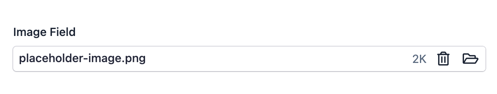

EasyAdmin Image Field
=====================

This field is used to manage the uploading of images to the backend. The entity
property only stores the path to the image (relative to the upload directory).
The actual image contents are stored on the server filesystem or on any remote
system configured via the `league/flysystem-bundle`_.

In :ref:`form pages (edit and new) <crud-pages>` it looks like this:

Basic Information
-----------------

* **PHP Class**: ``EasyCorp\Bundle\EasyAdminBundle\Field\ImageField``
* **Doctrine DBAL Type** used to store this value: ``string``
* **Symfony Form Type** used to render the field: ``FileUploadType``, a custom
  form type created by EasyAdmin
* **Rendered as**:

  .. code-block:: html

    <!-- when loading the page this is transformed into a dynamic widget via JavaScript -->
    <input type="file">

Options
-------

setBasePath
~~~~~~~~~~~

By default, images are loaded in read-only pages (``index`` and ``detail``) "as is",
without changing their path. If you serve your images under some path (e.g.
``uploads/images/``) use this option to configure that::

    yield ImageField::new('...')->setBasePath('uploads/images/');

setUploadDir
~~~~~~~~~~~~

By default, the contents of uploaded images are stored into files inside the
``<your-project-dir>/public/uploads/images/`` directory. Use this option to
change that location. The argument is the directory relative to your project root::

    yield ImageField::new('...')->setUploadDir('assets/images/');
    // the property will only store the file path relative to this dir
    // (e.g. 'logo.png', 'venue/layout.jpg')

setFileConstraints
~~~~~~~~~~~~~~~~~~

By default, the uploaded file is validated using an empty `Image constraint`_
(which means it only validates that the uploaded file is of type image). Use this
option to define the constraints applied to the uploaded file::

    yield ImageField::new('...')->setFileConstraints(new Image(filenameCharset: 'ASCII'));

setUploadedFileNamePattern
~~~~~~~~~~~~~~~~~~~~~~~~~~

By default, uploaded images are stored with the same file name and extension as
the original files. Use this option to rename the image files after uploading.
The string pattern passed as argument can include the following special values:

* ``[DD]``, the day part of the current date (with leading zeros, obtained as ``date('d')``)
* ``[MM]``, the month part of the current date (with leading zeros, obtained as ``date('m')``)
* ``[YYYY]``, the full year of the current date (obtained as ``date('Y')``)
* ``[YY]``, the two-digit year of the current date (obtained as ``date('y')``)
* ``[hh]``, the hour of the current time in 24h format (with leading zeros, obtained as ``date('H')``)
* ``[mm]``, the minutes of the current time (with leading zeros, obtained as ``date('i')``)
* ``[ss]``, the seconds of the current time (with leading zeros, obtained as ``date('s')``)
* ``[timestamp]``, the current timestamp (obtained as ``time()``; e.g. ``1773256492``)
* ``[name]``, the original name of the uploaded file
* ``[slug]``, the slug of the original name of the uploaded file generated with Symfony's
  String component (all lowercase and using ``-`` as the separator)
* ``[extension]``, the original extension of the uploaded file (without the leading dot, e.g. ``png``)
* ``[contenthash]``, a SHA1 hash of the original file contents (40-char hexadecimal
  string, e.g. ``3dfd6a9fbb83413b7f47c913ce2a95416dc6da88``)
* ``[randomhash]``, a random hash not related in any way to the original file contents
  (40-char hexadecimal string, e.g. ``8ff61576fb5f07f82dd9dbb7874cef74e24fcb26``)
* ``[uuid]``, a random UUID v4 value formatted as RFC 4122 (36-char hexadecimal string,
  e.g. ``d9e7a184-5d5b-11ea-a62a-3499710062d0``) (generated with Symfony's Uid component)
* ``[uuid32]``, a random UUID v4 value formatted as Base 32 (26-char string,
  e.g. ``6SWYGR8QAV27NACAHMK5RG0RPG``) (generated with Symfony's Uid component)
* ``[uuid58]``, a random ULID value formatted as Base 58 (22-char string,
  e.g. ``TuetYWNHhmuSQ3xPoVLv9M``) (generated with Symfony's Uid component)
* ``[ulid]``, a random ULID value (26-char string, e.g. ``01AN4Z07BY79KA1307SR9X4MV3``)
  (generated with Symfony's Uid component)

.. deprecated:: 5.1

    The ``[day]``, ``[month]`` and ``[year]`` placeholders are deprecated. Use
    ``[DD]``, ``[MM]`` and ``[YYYY]`` instead. The old placeholders will be
    removed in EasyAdmin 6.0.

You can combine them in any way::

    yield ImageField::new('...')
        ->setUploadedFileNamePattern('[YYYY]/[MM]/[DD]/[slug]-[contenthash].[extension]');

The argument of this method also accepts a closure that receives as its first
argument the Symfony's UploadedFile instance::

    yield ImageField::new('...')->setUploadedFileNamePattern(
        fn (UploadedFile $file): string => sprintf('upload_%d_%s.%s', random_int(1, 999), $file->getFilename(), $file->guessExtension()))
    );

isDeletable
~~~~~~~~~~~

By default, the image upload widget shows a "delete" checkbox that allows users
to remove the uploaded image. Use this option to hide that checkbox::

    yield ImageField::new('...')->isDeletable(false);

isDownloadable
~~~~~~~~~~~~~~

By default, a link to download the uploaded image is displayed next to the form
field. Use this option to hide that link::

    yield ImageField::new('...')->isDownloadable(false);

isViewable
~~~~~~~~~~

By default, a link to view the uploaded image is displayed next to the form field.
Use this option to hide that link::

    yield ImageField::new('...')->isViewable(false);

maxSize
~~~~~~~

Use this option to set the maximum allowed image size. The value can be an integer
(number of bytes) or a suffixed string (e.g. ``'200k'``, ``'2M'``, ``'1G'`` for
SI units or ``'1Ki'``, ``'1Mi'`` for binary units)::

    yield ImageField::new('...')->maxSize('5M');
    yield ImageField::new('...')->maxSize(1048576); // 1 MB in bytes

You can customize the error message by passing a second argument::

    yield ImageField::new('...')->maxSize('2M', 'The image "{{ name }}" is too large ({{ size }} {{ suffix }}). Maximum allowed: {{ limit }} {{ suffix }}.');

The available placeholders for the error message are: ``{{ file }}`` (the absolute
file path), ``{{ name }}`` (the base file name), ``{{ size }}`` (the file size),
``{{ limit }}`` (the maximum allowed size) and ``{{ suffix }}`` (the size unit,
e.g. ``kB``, ``MB``).

mimeTypes
~~~~~~~~~

By default, the accepted MIME types are set to ``image/*``, which restricts the
browser's file dialog to image files. Use this option to customize the accepted
file types. The value is a string with a comma-separated list of file extensions
or MIME types. You can use any value valid in the `HTML "accept" attribute`_::

    yield ImageField::new('...')->mimeTypes('.png,.jpg,.webp');
    yield ImageField::new('...')->mimeTypes('image/png,image/jpeg');

When this option is set, the corresponding MIME types are also added
automatically as validation constraints. You can customize the error message
shown when the validation fails by passing a second argument::

    yield ImageField::new('...')->mimeTypes('.png,.jpg', 'The image "{{ name }}" has MIME type "{{ type }}" but only "{{ types }}" are allowed.');

The available placeholders for the error message are: ``{{ file }}`` (the absolute
file path), ``{{ name }}`` (the base file name), ``{{ type }}`` (the MIME type of
the uploaded file) and ``{{ types }}`` (the list of allowed MIME types).

Replaced File Behavior
~~~~~~~~~~~~~~~~~~~~~~

When a user uploads a new image to replace an existing one, ``ImageField``
controls what happens to the old file on disk. There are three behaviors:

``deleteReplacedFile``
    This is the **default** behavior. The old file is deleted from disk. If the
    new file has the same name as an existing file, a numeric suffix (``_1``,
    ``_2``, etc.) is appended to avoid conflicts::

        yield ImageField::new('...')->deleteReplacedFile();

``keepReplacedFile``
    The old file is kept on disk. If you upload a new file with the same name,
    the contents are silently overwritten::

        yield ImageField::new('...')->keepReplacedFile();

``keepReplacedFileOrFail``
    The old file is kept on disk. If the new file's name conflicts with an
    existing file, an error is thrown::

        yield ImageField::new('...')->keepReplacedFileOrFail();

Flysystem Integration (Remote Storage)
--------------------------------------

By default, ``ImageField`` stores uploaded images on the local filesystem. If you
need to store images in a remote storage service (Amazon S3, Google Cloud Storage,
Azure Blob Storage, etc.) you can integrate with `Flysystem`_ via the
`league/flysystem-bundle`_.

Refer to the :doc:`FileField documentation </fields/FileField>` for the
installation and Flysystem configuration steps.

Usage
~~~~~

Use the ``setFlysystemStorage()`` method to tell EasyAdmin which Flysystem storage
to use. The argument is the service ID of the storage as defined in your Flysystem
configuration (e.g. ``default.storage``)::

    yield ImageField::new('photo')
        ->setFlysystemStorage('default.storage')
        ->setUploadDir('images/')
        ->setUploadedFileNamePattern('[uuid].[extension]');

setFlysystemStorage
~~~~~~~~~~~~~~~~~~~

Sets the Flysystem storage service ID to use for uploading and deleting images.
This is the key you defined under ``flysystem.storages`` in your Flysystem
configuration::

    yield ImageField::new('...')->setFlysystemStorage('default.storage');

When this option is set, EasyAdmin automatically replaces the local upload,
delete, and validation callables with Flysystem equivalents. The upload directory
configured with ``setUploadDir()`` is used as a path prefix inside the Flysystem
storage (not as a local directory).

setFlysystemUrlPrefix
~~~~~~~~~~~~~~~~~~~~~

**This method is optional.** By default, EasyAdmin generates the public URL of
each image from the Flysystem storage itself (via the ``public_url`` or
``public_url_generator`` option configured for that storage). Use this method
only to override that default; for example when the admin UI needs to serve
images from a different host than the one configured in Flysystem, or when your
Flysystem storage has no public URL generator configured::

    yield ImageField::new('...')->setFlysystemUrlPrefix('https://cdn.example.com/uploads');

When set, this prefix is combined with the image path to generate the full URL
shown in the ``index`` and ``detail`` pages, and takes precedence over the
Flysystem ``public_url`` configuration.

.. note::

    When using Flysystem, the ``setBasePath()`` option is ignored. Configure
    ``public_url`` in your Flysystem storage, or call ``setFlysystemUrlPrefix()``
    to override it.

All existing options (``setUploadedFileNamePattern()``, ``setFileConstraints()``,
``mimeTypes()``, ``maxSize()``, replaced file behaviors, ``isDeletable()``) continue
to work exactly the same way with Flysystem. See the
:doc:`FileField documentation </fields/FileField>` for details about how
Flysystem integration works internally.

.. _`HTML "accept" attribute`: https://developer.mozilla.org/en-US/docs/Web/HTML/Reference/Attributes/accept
.. _`Image constraint`: https://symfony.com/doc/current/reference/constraints/Image.html
.. _`Flysystem`: https://flysystem.thephpleague.com
.. _`league/flysystem-bundle`: https://github.com/thephpleague/flysystem-bundle
